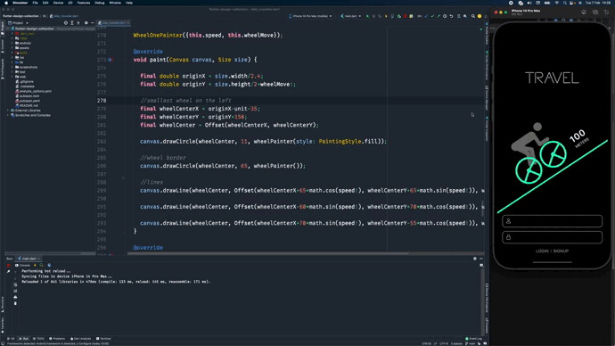

# 😍🔥 Flutter Animation Collection 💙 


A collection of Flutter Custom Animations and UI Kits.

Star⭐ the repo and follow me if you like what you see🤩 

## ✨ Requirements

* Any Operating System (ie. MacOS X, Linux, Windows)
* Any IDE with Flutter SDK installed (ie. IntelliJ, Android Studio, VSCode etc)
* A little knowledge of Dart and Flutter
* A brain to think 😂😂


## Get Started
Run:
```shell
git clone https://github.com/martinoyovo/flutter-design-collection.git
flutter clean
flutter packages get
flutter run
```

## Screenshots & Gifs

#### Animated Flutter Logo -- [Link to code](https://github.com/martinoyovo/flutter-design-collection/blob/main/lib/flutterlogo.dart)


---

#### Bike Animation -- [Link to code](https://github.com/martinoyovo/flutter-design-collection/blob/main/lib/bike_traveler.dart)



A few resources to get you started if this is your first Flutter project:

- [Lab: Write your first Flutter app](https://docs.flutter.dev/get-started/codelab)
- [Cookbook: Useful Flutter samples](https://docs.flutter.dev/cookbook)

For help getting started with Flutter development, view the
[online documentation](https://docs.flutter.dev/), which offers tutorials,
samples, guidance on mobile development, and a full API reference.
